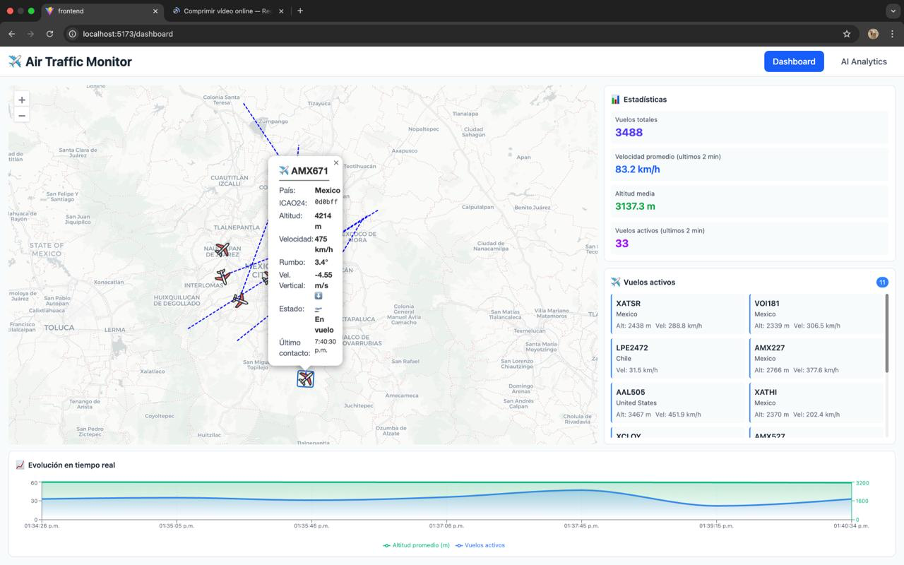

# ✈️ Air Traffic Monitor - CDMX

Sistema de monitoreo en tiempo real de tráfico aéreo sobre la Ciudad de México, desarrollado para el Hackathon de Zabbix Cloud. Combina análisis de datos en tiempo real, inteligencia artificial y visualización interactiva.




---

## 🎯 Objetivo del Proyecto

Desarrollar una solución completa que combine:
- ✅ Monitoreo activo con Zabbix Cloud
- ✅ Consumo de API pública de OpenSky Network
- ✅ Aplicación web interactiva con visualización en tiempo real
- ✅ Automatizaciones reflejadas en la interfaz
- ✅ Análisis inteligente con IA (Google Gemini)

---

## 🏗️ Arquitectura del Sistema
```
┌─────────────────┐
│   OpenSky API   │ (OAuth2 - cada 20s)
└────────┬────────┘
         │
         ▼
┌──────────────────────┐
│  FastAPI Backend     │
│  + WebSocket Server  │
└─────────┬────────────┘
          │
     ┌────┴─────┬──────────┐
     │          │          │
     ▼          ▼          ▼
┌─────────┐ ┌─────────┐ ┌──────────────┐
│PostgreSQL│ │ Zabbix  │ │ React Frontend│
│         │ │ Agent   │ │ + WebSocket   │
└─────────┘ └────┬────┘ └──────────────┘
                  │
                  ▼
         ┌────────────────┐
         │  Zabbix Cloud  │
         │  (Monitoring)  │
         └────────────────┘
```

---

## 🛠️ Stack Tecnológico

### Backend
- **FastAPI** - Framework web moderno y rápido
- **Python 3.11** - Lenguaje principal
- **PostgreSQL** - Base de datos relacional
- **SQLAlchemy** (async) - ORM
- **python-socketio** - Comunicación en tiempo real
- **APScheduler** - Tareas programadas
- **httpx** - Cliente HTTP asíncrono

### Frontend
- **React 18** - Framework UI
- **React Router** - Navegación
- **Socket.IO Client** - WebSocket
- **React Leaflet** - Mapas interactivos
- **Recharts** - Gráficas
- **Framer Motion** - Animaciones
- **TailwindCSS** - Estilos
- **Axios** - Cliente HTTP

### Monitoreo
- **Zabbix Cloud** - Plataforma de monitoreo
- **Zabbix Agent 2** - Recolección de métricas

### Inteligencia Artificial
- **Google Gemini 2.0 Flash** - Análisis y predicciones
- **ElevenLabs** - Síntesis de voz (TTS) para insights y alertas generadas por Gemini

### Infraestructura
- **Docker** - Containerización
- **Docker Compose** - Orquestación
- **Vultr** - Cloud provider (ready to deploy)

---

## 🚀 Características Principales

### 📊 Dashboard en Tiempo Real
- **Mapa interactivo** con vuelos en vivo
- **Marcadores animados** con interpolación suave
- **Información detallada** de cada vuelo (callsign, altitud, velocidad, rumbo)
- **Gráficas en tiempo real** de tráfico y métricas
- **Actualización automática** cada 20 segundos

### 🤖 Análisis Inteligente con IA
- **Insights automáticos** sobre patrones de tráfico
- **Predicciones** de tráfico para próxima hora
- **Chatbot conversacional** para consultas en lenguaje natural
- **Reportes ejecutivos** generados automáticamente
- **Análisis contextual** basado en datos históricos

### 📈 Monitoreo y Automatización
- **Métricas en tiempo real:**
  - Total de vuelos detectados
  - Vuelos activos (últimos 2 minutos)
  - Aeronaves únicas
  - Altitud promedio
  - Velocidad promedio

- **Triggers automáticos:**
  - Alto volumen de tráfico → Limpieza de BD
  - API no responde → Alerta crítica
  - Tráfico bajo → Notificación informativa
  - Métricas anormales → Análisis automático

- **Alertas visuales:**
  - Notificaciones toast en tiempo real
  - Panel de alertas con severidad (info/warning/critical)
  - Indicadores de estado del sistema

### 🔄 Comunicación en Tiempo Real
- **WebSocket bidireccional** para updates instantáneos
- **Eventos emitidos:**
  - `flights_update` - Nuevos vuelos detectados
  - `stats_update` - Estadísticas actualizadas
  - `zabbix_alert` - Alertas del sistema
  - `cleanup_executed` - Limpieza de BD

---

## 📦 Instalación y Configuración

### Prerrequisitos
- Docker y Docker Compose instalados
- Credenciales de OpenSky Network (OAuth2)
- API Key de Google Gemini
- Cuenta de Zabbix Cloud (trial gratuito)

### 1. Clonar el repositorio
```bash
git clone https://github.com/tu-usuario/air-traffic-monitor.git
cd air-traffic-monitor
```

### 2. Configurar variables de entorno

#### Backend (`backend/.env`)
```bash
# Database
DATABASE_URL=postgresql+asyncpg://postgres:postgres@db:5432/air_traffic

# OpenSky OAuth2
OPENSKY_CLIENT_ID=tu_client_id
OPENSKY_CLIENT_SECRET=tu_client_secret

# Zabbix
ZABBIX_WEBHOOK_SECRET=tu_secret_token

# Gemini API
GEMINI_API_KEY=tu_gemini_api_key

# ElevenLabs (Text-to-Speech) - opcional
ELEVENLABS_API_KEY=tu_elevenlabs_api_key

# App
ENVIRONMENT=development
FRONTEND_URL=http://localhost:3000
```

#### Frontend (`.env`)
```bash
REACT_APP_API_URL=http://localhost:8000
REACT_APP_WS_URL=http://localhost:8000
```

### 3. Levantar servicios

#### Backend con Docker
```bash
docker-compose up -d
```

Servicios disponibles:
- Backend API: http://localhost:8000
- PostgreSQL: localhost:5432
- Zabbix Agent: localhost:10050

#### Frontend
```bash
cd frontend
npm install
npm run ev
```

Frontend disponible: http://localhost:5137

---

## 📡 API Endpoints

### Vuelos
- `GET /api/flights/active` - Vuelos activos (últimos 2 min)

### Estadísticas
- `GET /api/stats/current` - Estadísticas en tiempo real
- `GET /api/stats/insights` - Análisis IA (Gemini)
- `GET /api/stats/predict` - Predicción de tráfico
- `POST /api/stats/chat?question=...` - Chatbot IA
- `GET /api/stats/report/daily` - Reporte ejecutivo

### Sistema
- `GET /api/system/health` - Estado del sistema
- `POST /api/zabbix/webhook` - Webhook de Zabbix

### WebSocket
- `WS /` - Conexión WebSocket para updates en tiempo real

---

## 🗺️ Área de Cobertura

**Bounding Box - Ciudad de México:**
```javascript
{
  lamin: 19.0,  // Latitud mínima
  lomin: -99.4, // Longitud mínima
  lamax: 19.6,  // Latitud máxima
  lomax: -98.9  // Longitud máxima
}
```

Centro del mapa: `19.4326° N, 99.1332° W`

---

## 🔧 Configuración de Zabbix

### Items Monitoreados
1. **Total de vuelos en BD** (cada 1 min)
2. **Vuelos activos** (cada 1 min)
3. **Estado de OpenSky API** (cada 2 min)
4. **Estado de FastAPI** (cada 30s)

### Triggers Configurados
1. **High Volume:** `active_flights > 15` → Limpieza + Webhook
2. **Critical Volume:** `active_flights > 25` → Alerta crítica
3. **API Down:** `opensky_status != 200` → Webhook
4. **Low Traffic:** `active_flights < 3` → Info

### Actions
- Limpieza automática de registros antiguos (>2 horas)
- Envío de webhooks a FastAPI
- Emisión de eventos WebSocket al frontend

---

## 📊 Datos Almacenados

### Tabla `flights`
```sql
- icao24 (string) - Identificador único del avión
- callsign (string) - Código de vuelo
- origin_country (string) - País de origen
- longitude/latitude (float) - Coordenadas
- altitude (float) - Altitud en metros
- velocity (float) - Velocidad en m/s
- heading (float) - Dirección en grados
- vertical_rate (float) - Velocidad vertical
- on_ground (boolean) - Si está en tierra
- last_contact (timestamp) - Último contacto
- created_at (timestamp) - Timestamp de inserción
```

### Tabla `system_events`
```sql
- event_type (string) - Tipo de evento
- severity (string) - info/warning/critical
- message (text) - Descripción
- metadata (jsonb) - Datos adicionales
- created_at (timestamp) - Timestamp
```

---

## 🎨 Características de UI/UX

### Dashboard Principal
- Layout responsivo con grid adaptativo
- Mapa ocupando 2/3 del espacio en desktop
- Panel lateral con stats y lista de vuelos
- Gráfica de evolución temporal en la parte inferior

### Panel de Analytics
- Chat IA lateral estilo VS Code/Cursor
- Cards informativos para cada métrica
- Botones de acción para generar análisis
- Markdown rendering para reportes

### Animaciones
- Transición suave de aviones en el mapa
- Loading states con spinners
- Toast notifications para alertas
- Animaciones de entrada/salida

---

## 🚀 Deploy en Producción (Vultr)

### Recursos Necesarios
- **Compute Instance:** 2GB RAM, 1 vCPU, Ubuntu 22.04
- **Managed PostgreSQL:** Starter plan (opcional)
- **Estimado:** ~$20-30/mes (gratis con créditos de trial)

### Steps
1. Provisionar recursos en Vultr
2. Subir código vía Git
3. Configurar `.env.production`
4. Ejecutar `docker-compose -f docker-compose.prod.yml up -d`
5. Configurar DNS (opcional)

---

## 📈 Métricas de Rendimiento

- **Latencia WebSocket:** <100ms
- **Frecuencia de actualización:** 20 segundos
- **Capacidad:** ~200 vuelos simultáneos
- **Retención de datos:** 2 horas (con limpieza automática)
- **Histórico de gráficas:** Últimos 30 puntos

---

## 🔒 Seguridad

- Variables de entorno para credenciales sensibles
- CORS configurado para orígenes específicos
- Token secreto para webhooks de Zabbix
- Sanitización de inputs en chatbot IA
- Rate limiting en API (pendiente para producción)

---

## 🧪 Testing
```bash
# Backend - Health check
curl http://localhost:8000/api/system/health

# Backend - Vuelos activos
curl http://localhost:8000/api/flights/active

# WebSocket - Prueba manual
docker-compose exec backend python test_socket.py

# Frontend
npm test
```

---


## 👥 Equipo

Desarrollado para el **Hackathon  ITZI** por
- Angel Jesus Zorrilla Cuevas
- Ronaldo Acevedo Ojeda
- Carlos Alberto Sosa Perera
- Amado Juvencio Jose Santiago

---


**⭐ Si te gustó este proyecto, dale una estrella en GitHub!**